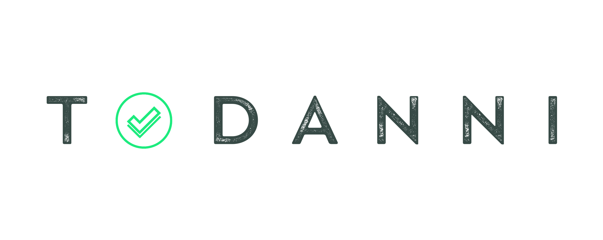

<!-- PROJECT LOGO -->
<br />
<p align="center">
  <a href="https://github.com/danni-popova/todanni">
    
  </a>

  <p align="center">
    A collaborative task manager.
    <br />
    <a href="https://github.com/danni-popova/toDanni"><strong>Explore the docs »</strong></a>
    <br />
    <br />
    <a href="https://github.com/danni-popova/toDanni">View Demo</a>
    ·
    <a href="https://github.com/danni-popova/toDanni/issues">Report Bug</a>
    ·
    <a href="https://github.com/danni-popova/toDanni/issues">Request Feature</a>
  </p>
</p>


<!-- TABLE OF CONTENTS -->
## Table of Contents

* [About the Project](#about-the-project)
    * [Built With](#built-with)
* [Getting Started](#getting-started)
    * [Prerequisites](#prerequisites)
    * [Installation](#installation)
* [Usage](#usage)
* [Roadmap](#roadmap)
* [Contributing](#contributing)
* [License](#license)
* [Contact](#contact)
* [Acknowledgements](#acknowledgements)


<!-- ABOUT THE PROJECT -->
## About The Project

[![Product Name Screen Shot][product-screenshot]](https://todanni.com/)

### Built With

* [React](https://reactjs.org/)
* [Material UI](https://material-ui.com/)
* [Redux](https://redux.js.org/)
* [Mirage JS](https://miragejs.com/)


<!-- GETTING STARTED -->
## Getting Started


To get a local copy up and running follow these simple steps.


### Prerequisites

This is an example of how to list things you need to use the software and how to install them.
* npm
```sh
yarn
```

### Installation

1. Clone the repo
```sh
git clone git@github.com:todanni/frontend.git
```
2. Install packages
```sh
yarn
```


<!-- USAGE EXAMPLES -->
## Usage

To run this locally:
```sh
yarn start
```

_For more examples, please refer to the [Documentation](https://documenter.getpostman.com/view/4194169/TVK77LqV)_


<!-- ROADMAP -->
## Roadmap


See the [open issues](https://github.com/danni-popova/todanni/issues) for a list of proposed features (and known issues).


<!-- CONTRIBUTING -->
## Contributing

Contributions are what make the open source community such an amazing place to be learn, inspire, and create. Any contributions you make are **greatly appreciated**.

1. Fork the Project
2. Create your Feature Branch (`git checkout -b feat/AmazingFeature`)
3. Commit your Changes (`git commit -m 'Add some AmazingFeature'`)
4. Push to the Branch (`git push origin feat/AmazingFeature`)
5. Open a Pull Request

<!-- LICENSE -->
## License

Distributed under the MIT License. See `LICENSE` for more information.


<!-- CONTACT -->
## Contact

Danni Popova - danni.develop@gmail.com

Project Link: [https://github.com/todanni/frontend](https://github.com/danni-popova/todanni)


<!-- MARKDOWN LINKS & IMAGES -->
<!-- https://www.markdownguide.org/basic-syntax/#reference-style-links -->
[issues-shield]: https://img.shields.io/github/issues/danni-popova/repo.svg?style=flat-square
[issues-url]: https://github.com/danni-popova/toDanni/issues
[license-shield]: https://img.shields.io/github/license/danni-popova/repo.svg?style=flat-square
[license-url]: https://github.com/danni-popova/toDanni/blob/master/LICENSE.txt
[linkedin-shield]: https://img.shields.io/badge/-LinkedIn-black.svg?style=flat-square&logo=linkedin&colorB=555
[linkedin-url]: https://www.linkedin.com/in/danni-popova-00a63b138/
[product-screenshot]: https://i.ibb.co/MRm9zFx/demo.png


